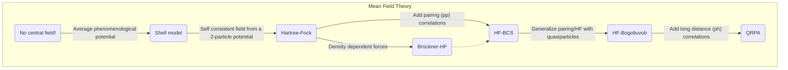

---
{"dg-publish":true,"permalink":"/neutrino-nucleus/03-mean-field-theory/"}
---

```mermaid
flowchart TD
    id1(No central field!)
    id2(Shell model)
    id3(Hartree-Fock)
    id4(HF-BCS)
    id5(HF-Bogoliuvob)
    id6(QRPA)
    id7(Brückner-HF)
    
    subgraph Mean Field Theory
    id1-->|Average phenomenological potential|id2
    id2-->|Self consistent field from a 2-particle potential|id3
    id3-->|"Add pairing (pp) correlations"|id4
    id4-->|Generalize pairing/HF with quasiparticles|id5
    id5-->|"Add long distance (ph) correlations"|id6
    id3-->|Density dependent forces|id7
    id7-.->id4
    end
```