---
{"dg-publish":true,"permalink":"/personal-notes/paula-pitch/"}
---

# Paula pitch
## Problem statement
We would like to get a precise structure of the ground state and low lying energy states for a set of nuclei. This will allow us to get the form factors for neutrino interactions when the momentum transfer is low.

## Why do we have a problem?
I study the low energy regime neutrinos (below 100 MeV) in the DUNE experiment, in particular supernova neutrinos, but solar and atmospheric neutrinos also fall in this regime. 

One of the major sources of systematic uncertainty in the study of neutrinos at all energies is the understanding of the neutrino-nucleus cross section. 
These uncertainties are especially large at low energies where experimental data is scarce, yet understanding and quantifying them is extremely important for the whole low energy physics program (supernova physics, supernova pointing, solar neutrinos, etc).

The current event generator used for low energy interactions in DUNE (MARLEY) has two major shortcomings:
- Missing interaction channels:
    - CC (charged current) antineutrino: $\bar{\nu}_e + {}^{40}\text{Ar} \rightarrow e^{+} + {}^{40}\text{Ca}^*$ reaction (odd-odd nucleus).
    - NC (neutral current): $\nu_x + {}^{40}\text{Ar} \rightarrow \nu_x + {}^{40}\text{Ar}^*$ reaction (even-even nucleus).
- Based on a simplified cross section model that starts failing at energies above 15-20 MeV. While the total cross section per energy it predicts (for the CC neutrino channel) is within the expected range, it gets the angular distribution and the transition rates to each individual excited nuclear state is wrong. This is important for several reason:
    - The angular distribution, other than for the general study of the supernova (flux parameters, neutrino self interactions, core-collapse mechanism) is very important for supernova pointing. DUNE will be part of the Supernova Early Warning System (SNEWS), where neutrino experiments alert telescopes around the world that a supernova is coming so they can point to the precise direction in the sky (as SN neutrinos arrive earlier than light).
    - Knowing the transition probability to a given nuclear state for a given neutrino energy is crucial to estimate its energy: each state has a specific deexcitation pattern and we rely on measuring the deexcitation products (mainly photons) to reconstruct the energy.
We need to expand the generator capabilities to design a more realistic low energy physics program.

## Workplan
I intend to work on improving the generator in two stages:
1. Implement the missing channels using the cross section model already in place.
2. Improve the cross section model.
Both these steps require **solving the nucleus**.

## Why do *I* need to solve the nucleus? And how?
1. Because I want to and I think its an interesting problem.
2. There are several published calculations that give total cross section estimates for the missing channels. But this is useless for our generator as they do not compute the individual matrix elements that describe the transitions to each individual nuclear state. 
3. The generators used for oscillation energy simulations use more sophisticated models, but completely ignore the discrete region as it is uninteresting for them: the final state after a high energy neutrino scatters will always be unbound, and most of the time will come with one or more nucleon knockouts. In the low energy case, however, the region that accumulates most of the total cross section is where the energy transfer is low enough that the transition is from the nuclear ground state to a excited bound state. Tl;dr: existing generators are not suited for our problem.
4. There are several solvers...

## Why tensor networks are promising
The usual way of solving the nucleus (other than pure ab-initio methods, which are another different road to take) is through incremental improvements of mean field theory:

<a class="markdown-embed-link" href="/neutrino-nucleus/mean-field-theory/" aria-label="Open link"><svg xmlns="http://www.w3.org/2000/svg" width="24" height="24" viewBox="0 0 24 24" fill="none" stroke="currentColor" stroke-width="2" stroke-linecap="round" stroke-linejoin="round" class="svg-icon lucide-link"><path d="M10 13a5 5 0 0 0 7.54.54l3-3a5 5 0 0 0-7.07-7.07l-1.72 1.71"></path><path d="M14 11a5 5 0 0 0-7.54-.54l-3 3a5 5 0 0 0 7.07 7.07l1.71-1.71"></path></svg></a>

# Mean field theory

```mermaid
    flowchart TD
        id1(No central field!)
        id2(Shell model)
        id3(Hartree-Fock)
        id4(HF-BCS)
        id5(HF-Bogoliuvob)
        id6(QRPA)
        id7(Brückner-HF)
        
        id1-->|Average phenomenological potential|id2
        id1-->|Self consistent field from a 2-particle potential|id3
        id3-->|"Add pairing (pp) correlations"|id4
        id4-->|Generalize pairing/HF with quasiparticles|id5
        id5-->|"Add long distance (ph) correlations"|id6
        id3-->|Density dependent forces|id7
        id7-.->id4
```

In brief summary: you solve for a mean field and then add residual interactions not accountable by this mean field. These can basically be divided into short distance particle-particle (*pp*) correlations and long distance particle-hole (*ph*) correlations.
Adding these extra correlations are essential to describing the excited states of the nucleus (e.g., the vibrational states of the nucleus can only be accounted for by the *ph* correlations).

The

## What do I have to do, and what does Paula
adf